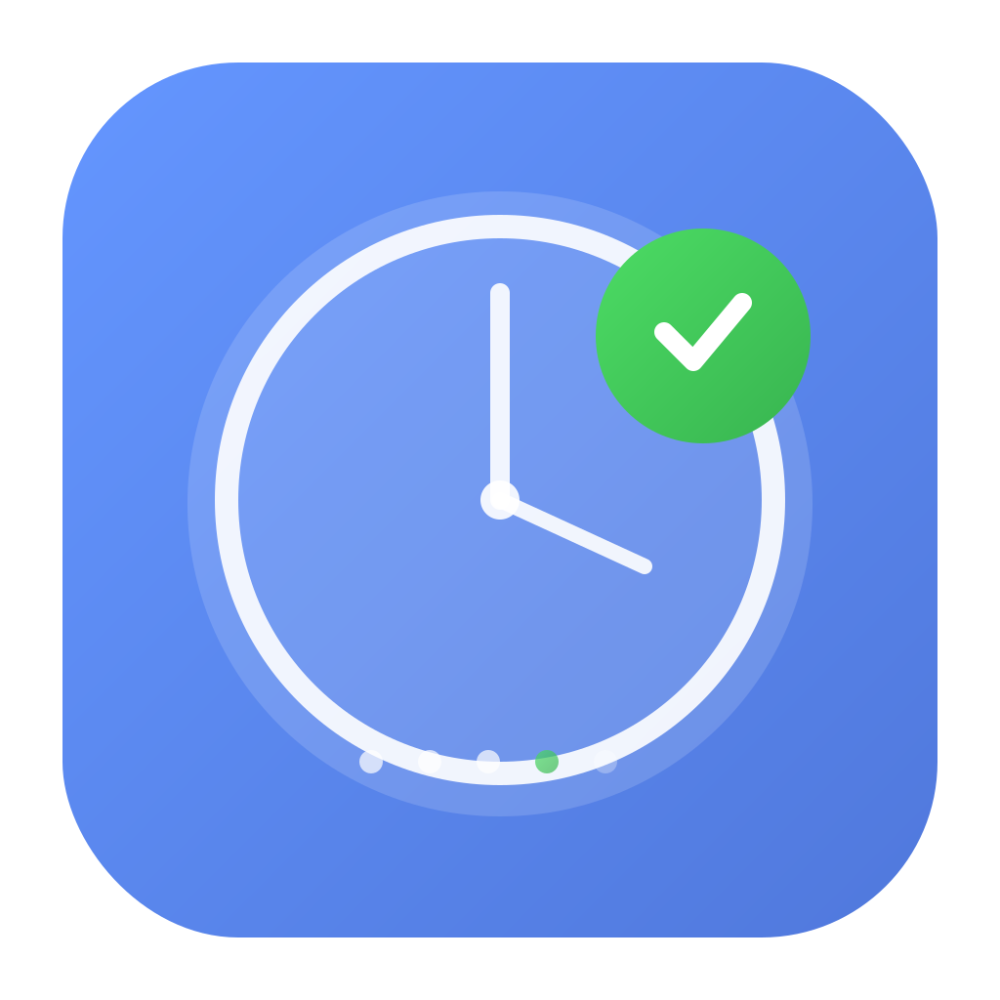

<div align="center">



# Task Floater

**A minimalist, always-on-top task manager for macOS with integrated Pomodoro timer**

[](https://www.apple.com/macos)
[](LICENSE)
[](https://github.com/cyrus-reap/task-floater/releases/latest)
[](https://www.typescriptlang.org/)
[](https://www.electronjs.org/)

[Features](#features) • [Installation](#installation) • [Documentation](#documentation) • [Contributing](#contributing)

</div>

---

## Overview

Task Floater is a productivity application designed to stay visible above all windows, providing instant access to your task list without disrupting your workflow. Built with modern design principles, it features a glassmorphism UI, integrated Pomodoro timer system, and focus mode for distraction-free work.

**Key Capabilities:**
- Always-on-top floating window with glassmorphism design
- **NEW:** Screenshot-based task capture with OCR (bulk import tasks from images)
- Integrated Pomodoro timer with customizable durations
- Focus mode for minimizing distractions
- Automatic task persistence and updates
- Full keyboard navigation support

## Screenshots

<div align="center">

| Full View | Command Palette |
|:-:|:-:|
|  | 
 |

| Focus Timer | Focus Mode | Compact Mode |
|:-:|:-:|:-:|
|  |  |  |

### Light Theme

| Full View | Compact | Focus Timer |
|:-:|:-:|:-:|
|  |  |  |

</div>

## Features

### Task Management
- **Always-on-top window** - Remains visible across all workspaces and full-screen apps
- **Screenshot-based capture** - Bulk import tasks from screenshots using local OCR
- **Glassmorphism UI** - Modern frosted glass aesthetic with smooth animations
- **Drag & drop reordering** - Organize tasks by dragging
- **Inline editing** - Double-click any task to edit in place
- **Automatic persistence** - Changes saved instantly to local storage
- **Search functionality** - Real-time task filtering

### Pomodoro Timer System
- **Integrated timers** - Optional timer for each task
- **Quick presets** - 15min, 25min, 30min, 45min, 1hr, 90min durations
- **Visual progress** - Animated progress bar with real-time countdown
- **Auto-advance** - Automatically proceeds to next task on completion
- **Audio notifications** - Alert sounds when timers complete
- **Persistent state** - Timer state survives app restarts

### Focus Mode
- **Distraction-free interface** - Hides completed tasks and UI chrome
- **Active task emphasis** - Running timers highlighted with visual effects
- **Keyboard shortcut** - Toggle with `Cmd+Shift+F`
- **Immersive design** - Darker background for concentration

### Developer Features
- **Security hardened** - Input validation, XSS prevention, Electron sandbox
- **Auto-updates** - Automatic update notifications via GitHub Releases
- **Type-safe** - Built with TypeScript strict mode
- **Well-documented** - Comprehensive guides and API documentation

## Installation

### Pre-built Application

**[📥 Download Latest Release](https://github.com/cyrus-reap/task-floater/releases/latest)**

#### macOS Installation

1. Download the appropriate DMG:
   - **Apple Silicon** (M1/M2/M3): `Task Floater-X.X.X-arm64.dmg`
   - **Intel**: `Task Floater-X.X.X.dmg`

2. Open the DMG file

3. **⚠️ First launch only** - Bypass Gatekeeper (one-time setup):

   This app is unsigned (free distribution). macOS will show a security warning:

   ```
   a. macOS shows: "Apple could not verify Task Floater.app"
   b. Click "Cancel" or "Done"
   c. Go to Applications folder
   d. Right-click (or Control+click) Task Floater.app
   e. Select "Open" from the menu
   f. Click "Open" in the confirmation dialog
   ```

   **Alternative (Terminal):**
   ```bash
   xattr -cr "/Applications/Task Floater.app" && open "/Applications/Task Floater.app"
   ```

4. Drag to Applications folder

5. Launch from Applications

**Why unsigned?** This is a free, open-source app. Code signing requires a $99/year Apple Developer membership. The app is 100% safe - review the [source code](https://github.com/cyrus-reap/task-floater) yourself!

**Subsequent launches:** The app will open normally. Updates are delivered automatically.

### Build from Source

**Requirements:** macOS 10.13+, Node.js 16+

```bash
git clone https://github.com/cyrus-reap/task-floater.git
cd task-floater
npm install
npm start
```

**Development mode:**
```bash
npm run dev  # Watch mode with auto-reload
```

## Usage

### Basic Operations

**Add task:** Type in the input field and press Enter
**Add from screenshot:** Click camera icon or press `Cmd+Shift+S`
**Set timer:** Click a duration preset before adding the task
**Start timer:** Click the play button (▶)
**Complete task:** Click the checkbox
**Delete task:** Click the delete button
**Reorder tasks:** Drag and drop
**Edit task:** Double-click the task title

### Screenshot-Based Task Capture

Quickly bulk-add tasks from any screen content using native macOS screenshot tool:

1. **Trigger capture:** Click the camera icon OR press `Cmd+Shift+S`
2. **Select region:** Just like `Cmd+Shift+4`, drag to select area containing tasks
3. **Review tasks:** Preview extracted tasks in modal (remove unwanted items)
4. **Bulk add:** Click "Add X Tasks" to import all at once

**Supported formats:**
- Plain text (each line becomes a task)
- Bullet points (-, •, *, ‣)
- Numbered lists (1., 2., etc.)
- Checkboxes ([ ], [x], ☐, ☑)
- Duration extraction (e.g., "30min", "1h", "45m" automatically parsed)

**Native UX:** Uses macOS's built-in screenshot tool for familiar, fast region selection. Press `Esc` to cancel anytime.

**Privacy:** Uses local OCR (Tesseract.js) - no cloud services, all processing happens on your machine.

### Keyboard Shortcuts

| Shortcut | Action |
|----------|--------|
| `Cmd+K` | Open Command Palette |
| `Cmd+Shift+S` | Capture tasks from screenshot |
| `Cmd+Shift+F` | Toggle Focus Mode |
| `Cmd+F` | Focus search |
| `↑` / `↓` | Navigate tasks |
| `Space` | Toggle task completion |
| `Enter` | Edit selected task |
| `Esc` | Clear input/selections |

[View all shortcuts →](docs/guides/SHORTCUTS.md)

### Focus Mode

Press `Cmd+Shift+F` or click the focus button to enter distraction-free mode:
- Hides completed tasks
- Removes UI chrome (search, stats, input)
- Emphasizes active timer
- Enables immersive dark theme

Perfect for deep work sessions and Pomodoro technique.

[Learn more about Focus Mode →](docs/guides/FOCUS-MODE.md)

## Architecture

Task Floater uses Electron's multi-process architecture with strict security boundaries:

**Main Process** (`src/main.ts`)
- Window lifecycle management
- IPC request handlers
- File system operations
- Auto-update coordination

**Preload Script** (`src/preload.ts`)
- Secure IPC bridge via `contextBridge`
- API exposure with type safety
- Context isolation enforcement

**Renderer Process** (`src/renderer.ts`)
- UI logic and event handling
- DOM manipulation
- Timer state management

**Security Model:**
- Context isolation enabled
- Node integration disabled
- Chromium sandbox active
- Content Security Policy enforced
- Input validation on all operations

[View security documentation →](docs/architecture/SECURITY.md)

## Technology Stack

| Component | Technology | Purpose |
|-----------|-----------|---------|
| Runtime | Electron 28.0 | Desktop application framework |
| Language | TypeScript 5.3+ | Type-safe development |
| UI | HTML/CSS3 | Glassmorphism design system |
| OCR | Tesseract.js 7.0 | Local screenshot text extraction |
| Build | electron-builder | Production packaging |
| Updates | electron-updater | Automatic updates |
| Security | Custom validation | Input sanitization & XSS prevention |

## Documentation

Complete documentation is available in the [`docs/`](docs/) directory:

**User Guides:**
- [Building from Source](docs/guides/BUILD.md) - Development setup and compilation
- [Release Management](docs/guides/RELEASING.md) - Version control and distribution
- [Focus Mode](docs/guides/FOCUS-MODE.md) - Distraction-free productivity
- [Keyboard Shortcuts](docs/guides/SHORTCUTS.md) - Complete shortcut reference

**Technical Documentation:**
- [Security Implementation](docs/architecture/SECURITY.md) - Threat model and mitigations
- [Code Standards](docs/architecture/BEST_PRACTICES.md) - Development guidelines
- [Feature Documentation](docs/architecture/FEATURES.md) - Technical specifications

**[📖 Full Documentation Index](docs/README.md)**

## Development

### Commands

```bash
npm start          # Build and launch application
npm run dev        # Development mode with auto-reload
npm run build      # Compile TypeScript
npm run validate   # Run type checking, linting, and formatting
npm run dist:mac   # Build production DMG
```

### Project Structure

```
src/
├── main.ts          # Main process (Electron)
├── preload.ts       # IPC bridge (security)
├── renderer.ts      # UI logic
├── constants.ts     # Configuration constants
├── validation.ts    # Input validators
├── types.d.ts       # Type definitions
└── index.html       # UI markup

docs/                # Documentation
├── guides/          # User guides
├── architecture/    # Technical specs
└── reports/         # Analysis reports

build/               # Build assets (icons)
scripts/             # Build scripts
```

## Data Storage

Task data is stored locally in JSON format:

**Location:** `~/Library/Application Support/task-floater/`
- `tasks.json` - Task data
- `settings.json` - Application preferences

**Privacy:** All data remains on your machine. No cloud sync or telemetry.

## Contributing

Contributions are welcome! Please follow these steps:

1. Fork the repository
2. Create a feature branch (`git checkout -b feature/your-feature`)
3. Make your changes with tests
4. Run validation (`npm run validate`)
5. Commit using conventional commits (`feat:`, `fix:`, etc.)
6. Push to your fork
7. Open a Pull Request

See [CONTRIBUTING.md](CONTRIBUTING.md) for detailed guidelines.

## Roadmap

**Planned Features:**
- Linear issue integration
- Custom theme support
- Cloud backup option
- Windows and Linux support
- Task categories and tagging
- Recurring task templates
- Priority indicators
- Import/export functionality

## License

This project is licensed under the MIT License. See [LICENSE](LICENSE) for details.

## Author

**Cyrus David Pastelero**
GitHub: [@cyrus-reap](https://github.com/cyrus-reap)
Email: cyrus@reap.hk

## Acknowledgments

Built with [Electron](https://www.electronjs.org/) and [TypeScript](https://www.typescriptlang.org/).
Design inspired by macOS Big Sur glassmorphism principles.

---

<div align="center">

**[Download](https://github.com/cyrus-reap/task-floater/releases/latest)** • **[Documentation](docs/README.md)** • **[Report Issue](https://github.com/cyrus-reap/task-floater/issues)**

Made with care for productivity enthusiasts

</div>
