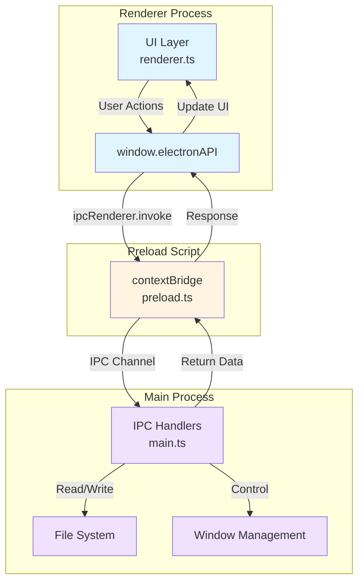

<div align="center">

# Task Floater ✨

<p align="center">
  <strong>A beautiful, modern floating task manager for macOS</strong>
</p>

<p align="center">
  <a href="#features">Features</a> •
  <a href="#installation">Installation</a> •
  <a href="#usage">Usage</a> •
  <a href="#development">Development</a> •
  <a href="#contributing">Contributing</a>
</p>

<p align="center">
  
  
  
  
</p>

</div>

---

## 🎯 Overview

Task Floater is a minimalist, always-on-top task manager for macOS featuring a stunning glassmorphism design. It floats above all your windows, giving you instant access to your tasks without disrupting your workflow.

## ✨ Features

- 🎨 **Glassmorphism UI** - Modern frosted glass design with smooth animations
- 📌 **Always on Top** - Stays above all windows, never gets buried
- 🖱️ **Draggable** - Position it anywhere on your screen
- ⏱️ **Pomodoro Timers** - Optional timer for each task with audio notifications
- 💾 **Auto-save** - Tasks persist automatically to local storage
- ⌨️ **Keyboard Shortcuts** - Quick task entry with Enter key
- 🎭 **Native macOS Integration** - Smooth animations and native window controls
- 🔒 **Privacy First** - All data stored locally, no cloud sync

## 📸 Screenshots

_Screenshots coming soon_

## 🚀 Quick Start

### Prerequisites

- macOS 10.13 or later
- Node.js 16+ and npm

### Installation

```bash
# Clone the repository
git clone https://github.com/cyrus-reap/task-floater.git
cd task-floater

# Install dependencies
npm install

# Build and run
npm start
```

**For development:**
```bash
# Watch mode with auto-restart
npm run dev
```

## Usage

### Adding Tasks

1. Type your task in the input field
2. Press **Enter** or click "Add"
3. Task appears with a smooth slide-in animation

### Completing Tasks

Click the checkbox next to any task to mark it complete. Completed tasks:
- Show a green checkmark with animation
- Get a strikethrough style
- Move to the bottom of the list
- Stay visible until you delete them

### Deleting Tasks

Click the **×** button on any task to remove it permanently.

### Window Controls

- **Yellow button**: Minimize the window to dock
- **Red button**: Close the app completely
- **Drag from header**: Click and hold the header to move the window anywhere

## Data Storage

All tasks are automatically saved to your local filesystem:
- **Location**: `~/Library/Application Support/task-floater/tasks.json`
- **Auto-save**: Tasks are saved immediately when you add, complete, or delete them
- **Persistent**: Your tasks will be there every time you open the app

## File Structure

```
task-floater/
├── src/
│   ├── main.ts           # Electron main process
│   ├── preload.ts        # Secure IPC bridge
│   ├── renderer.ts       # UI logic and interactions
│   ├── types.d.ts        # TypeScript type definitions
│   └── index.html        # UI with glassmorphism styles
├── dist/                 # Compiled JavaScript (auto-generated)
├── package.json
├── tsconfig.json
└── README.md
```

## Development

### Watch Mode

Automatically rebuild TypeScript on file changes:

```bash
npm run dev
```

This runs TypeScript in watch mode and auto-restarts Electron when changes are detected.

### Manual Build

```bash
npm run build
```

### Project Scripts

- `npm run build` - Compile TypeScript to JavaScript
- `npm run watch` - Watch mode for development
- `npm start` - Build and run the app
- `npm run dev` - Watch mode + auto-restart Electron

## Keyboard Shortcuts

- **Enter** in input field: Add task
- **macOS Command+Q**: Quit the app

## Customization

### Window Position

Edit `src/main.ts:22-23` to change default position:

```typescript
x: screenWidth - 400,  // 20px from right edge
y: 50,                  // 50px from top
```

### Window Size

Edit `src/main.ts:20-21`:

```typescript
width: 380,
height: 550,
```

### Colors & Styling

All styles are in `src/index.html` inside the `<style>` tag. The design uses:
- Glassmorphism effects with `backdrop-filter`
- Smooth CSS animations
- Gradient backgrounds
- Responsive hover states

## Design Features

### Glassmorphism

The app uses modern glassmorphism design with:
- Frosted glass background (`backdrop-filter: blur(40px)`)
- Semi-transparent panels
- Subtle borders and shadows
- Gradient overlays

### Animations

- **Fade in**: Window appears smoothly
- **Slide in**: Tasks animate from left when added
- **Hover effects**: Subtle scale and position changes
- **Transitions**: Smooth 0.3s ease transitions throughout

## Troubleshooting

### Window not showing

1. Check if it's minimized in the dock
2. Quit and restart the app
3. Check if window is off-screen

### Tasks not persisting

1. Check file permissions in `~/Library/Application Support/task-floater/`
2. Look for errors in the terminal/console
3. Delete `tasks.json` and restart (will lose current tasks)

### App won't start

1. Make sure you ran `npm install`
2. Check that `npm run build` completed without errors
3. Try deleting `node_modules` and `dist` folders, then reinstall:
   ```bash
   rm -rf node_modules dist
   npm install
   npm run build
   npm start
   ```

## 🏗️ Architecture

Task Floater follows Electron's three-process architecture:

- **Main Process** (`src/main.ts`) - Window management, IPC handlers, file I/O
- **Preload Script** (`src/preload.ts`) - Secure IPC bridge via contextBridge
- **Renderer Process** (`src/renderer.ts`) - UI logic and DOM manipulation



### Tech Stack

- **Electron** 28.0.0 - Cross-platform desktop framework
- **TypeScript** 5.3+ - Type-safe development
- **Native macOS APIs** - Window transparency, always-on-top behavior
- **CSS3** - Glassmorphism effects with backdrop-filter

## 🗺️ Roadmap

- [ ] Linear integration (in progress)
- [ ] Customizable themes
- [ ] Cloud sync option
- [ ] Windows/Linux support
- [ ] Task categories and tags
- [ ] Recurring tasks
- [ ] Task priorities
- [ ] Export/import functionality

## 🤝 Contributing

Contributions are welcome! Please read [CONTRIBUTING.md](CONTRIBUTING.md) for details on our code of conduct and the process for submitting pull requests.

### Development Setup

1. Fork the repository
2. Create your feature branch (`git checkout -b feature/amazing-feature`)
3. Make your changes and test thoroughly
4. Commit your changes (`git commit -m 'feat: add amazing feature'`)
5. Push to the branch (`git push origin feature/amazing-feature`)
6. Open a Pull Request

See [CONTRIBUTING.md](CONTRIBUTING.md) for more detailed guidelines.

## 📝 License

This project is licensed under the MIT License - see the [LICENSE](LICENSE) file for details.

## 👤 Author

**Cyrus David Pastelero**

- GitHub: [@cyrus-reap](https://github.com/cyrus-reap)
- Email: cyrus@reap.hk

## 🙏 Acknowledgments

- Inspired by modern macOS design principles
- Built with Electron and TypeScript
- Glassmorphism UI inspired by macOS Big Sur and later

## 📮 Support

If you like this project, please consider:

- ⭐ Starring the repository
- 🐛 Reporting bugs via [Issues](https://github.com/cyrus-reap/task-floater/issues)
- 💡 Suggesting features
- 🤝 Contributing to the codebase
