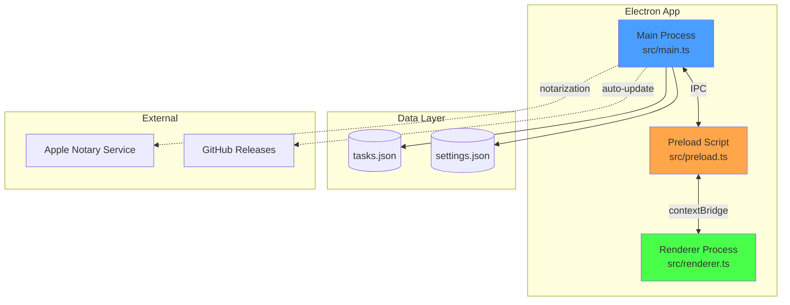
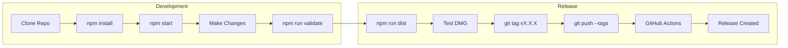

# Task Floater Documentation

Complete documentation for Task Floater - a modern floating task manager for macOS.

## Architecture Overview



---

## Quick Links

### For Users
- [Main README](../README.md) - Overview, installation, features
- [Keyboard Shortcuts](guides/SHORTCUTS.md) - All keyboard commands
- [Focus Mode](guides/FOCUS-MODE.md) - Distraction-free productivity

### For Developers
- [Building from Source](guides/BUILD.md) - Development setup
- [Code Signing](guides/CODE-SIGNING.md) - Sign & notarize for distribution
- [Releasing Updates](guides/RELEASING.md) - Release workflow

### Architecture & Design
- [Security](architecture/SECURITY.md) - Security implementation
- [Features](architecture/FEATURES.md) - Technical feature docs
- [Best Practices](architecture/BEST_PRACTICES.md) - Code standards

---

## Documentation Structure

```
docs/
├── README.md                 # This file - documentation index
├── guides/                   # How-to guides
│   ├── BUILD.md              # Building and development
│   ├── CODE-SIGNING.md       # Code signing & notarization
│   ├── RELEASING.md          # Release workflow
│   ├── FOCUS-MODE.md         # Focus mode feature
│   └── SHORTCUTS.md          # Keyboard shortcuts
├── architecture/             # Technical documentation
│   ├── SECURITY.md           # Security implementation
│   ├── FEATURES.md           # Feature documentation
│   └── BEST_PRACTICES.md     # Code quality standards
└── reports/                  # Historical reports
    └── ...                   # Code quality & improvement reports
```

**Root-level docs:**
```
/
├── README.md            # Project overview
├── CHANGELOG.md         # Version history
├── CONTRIBUTING.md      # Contribution guidelines
├── CODE_OF_CONDUCT.md   # Community guidelines
└── CLAUDE.md            # AI assistant context
```

---

## Development Workflow



---

## Common Tasks

### I want to...

| Task | Documentation |
|------|---------------|
| Install the app | [README.md](../README.md#installation) |
| Learn keyboard shortcuts | [SHORTCUTS.md](guides/SHORTCUTS.md) |
| Build from source | [BUILD.md](guides/BUILD.md) |
| Sign & notarize the app | [CODE-SIGNING.md](guides/CODE-SIGNING.md) |
| Create a release | [RELEASING.md](guides/RELEASING.md) |
| Understand security model | [SECURITY.md](architecture/SECURITY.md) |
| Contribute code | [CONTRIBUTING.md](../CONTRIBUTING.md) |
| Use focus mode | [FOCUS-MODE.md](guides/FOCUS-MODE.md) |

---

## External Resources

- **Repository**: [github.com/Cyvid7-Darus10/task-floater](https://github.com/Cyvid7-Darus10/task-floater)
- **Releases**: [Latest Release](https://github.com/Cyvid7-Darus10/task-floater/releases/latest)
- **Issues**: [Report a Bug](https://github.com/Cyvid7-Darus10/task-floater/issues)
- **Electron Docs**: [electronjs.org/docs](https://www.electronjs.org/docs)

---

## Need Help?

1. Check the relevant guide above
2. Search [existing issues](https://github.com/Cyvid7-Darus10/task-floater/issues)
3. Create a new issue if needed

---

*Last updated: January 2026*
