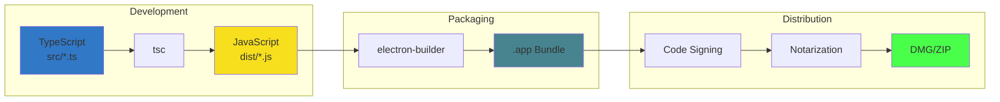

# Building Task Floater

Guide for building Task Floater from source for development and distribution.

## Build Pipeline



---

## Prerequisites

- **Node.js** v18 or higher
- **npm** v9 or higher
- **macOS** (for macOS builds)

```bash
# Verify versions
node --version  # v18+
npm --version   # v9+
```

---

## Quick Start

```bash
# Clone and install
git clone https://github.com/Cyvid7-Darus10/task-floater.git
cd task-floater
npm install

# Development
npm start

# Production build
npm run dist
```

---

## Build Commands

| Command | Description | Output |
|---------|-------------|--------|
| `npm run build` | Compile TypeScript | `dist/*.js` |
| `npm start` | Run in development | Opens app |
| `npm run pack` | Package without installer | `release/mac/*.app` |
| `npm run dist` | Full distribution build | `release/*.dmg` |

---

## Development Build

### Run the App

```bash
npm start
```

This compiles TypeScript and launches Electron in development mode.

### Watch Mode

```bash
npm run dev
```

Watches for file changes and reloads automatically.

### Type Checking

```bash
npm run typecheck    # Check types
npm run lint         # Lint code
npm run format:check # Check formatting
npm run validate     # All of the above
```

---

## Production Build

### Step 1: Validate Code

```bash
npm run validate
```

Runs type checking, linting, and format verification.

### Step 2: Build DMG

```bash
npm run dist
```

Creates:
```
release/
├── Task Floater-X.X.X.dmg           # Intel (x64)
├── Task Floater-X.X.X-arm64.dmg     # Apple Silicon
├── Task Floater-X.X.X-mac.zip       # Intel portable
├── Task Floater-X.X.X-arm64-mac.zip # Apple Silicon portable
└── latest-mac.yml                   # Auto-update manifest
```

### Step 3: Test the Build

```bash
# Open the DMG
open release/Task\ Floater-*.dmg

# Or run the app directly
open release/mac/Task\ Floater.app
```

---

## Code Signing & Notarization

For professional distribution without Gatekeeper warnings, you need to sign and notarize your app.

**See: [Code Signing Guide](CODE-SIGNING.md)**

Quick summary:
1. Get Apple Developer Account ($99/year)
2. Create Developer ID certificate
3. Configure `.env.signing`
4. Run `source .env.signing && npm run dist`

---

## Build Configuration

### package.json Build Section

```json
{
  "build": {
    "appId": "com.reap.task-floater",
    "productName": "Task Floater",
    "mac": {
      "category": "public.app-category.productivity",
      "target": [
        { "target": "dmg", "arch": ["x64", "arm64"] },
        { "target": "zip", "arch": ["x64", "arm64"] }
      ]
    },
    "files": [
      "dist/**/*",
      "src/index.html",
      "package.json"
    ]
  }
}
```

### Files Included

| Included | Not Included |
|----------|--------------|
| `dist/**/*` (compiled JS) | `src/*.ts` (source) |
| `src/index.html` | `node_modules/` (dev deps) |
| `package.json` | `test/` |
| Production dependencies | Documentation |

---

## App Icons

Icons must be placed in `build/` directory before building:

```
build/
├── icon.icns    # macOS (required)
├── icon.ico     # Windows
└── icon.png     # Linux (512x512+)
```

**Generate icons:**
```bash
npm run icons
```

See `build/README.md` for manual icon creation.

---

## Troubleshooting

### "Cannot find module"

```bash
npm run clean
npm install
npm run build
```

### "App is damaged" on macOS

For unsigned builds:
```bash
xattr -cr /Applications/Task\ Floater.app
```

Or: Right-click → Open → Click "Open"

For signed builds: See [Code Signing Guide](CODE-SIGNING.md)

### Build is too large

Expected sizes:
- DMG: ~90-100 MB
- Unpacked app: ~150-200 MB

If larger, check that `files` array in package.json is correct.

### TypeScript errors

```bash
npm run typecheck
```

Fix all type errors before building.

---

## Platform Notes

### macOS

- **Apple Silicon (M1/M2/M3)**: Builds `arm64` architecture
- **Intel**: Builds `x64` architecture
- **Universal**: Build both with `arch: ["x64", "arm64"]`

### Windows (Cross-compile)

```bash
# Requires wine on macOS
npm run dist -- --win
```

### Linux (Cross-compile)

```bash
npm run dist -- --linux
```

---

## CI/CD Build

GitHub Actions automatically builds on:
- Push to `main` branch
- Pull requests
- Tags (creates release)

See `.github/workflows/ci.yml` and `.github/workflows/release.yml`

---

## Quick Reference

| Task | Command |
|------|---------|
| Install dependencies | `npm install` |
| Run development | `npm start` |
| Type check | `npm run typecheck` |
| Lint | `npm run lint` |
| Format | `npm run format` |
| Validate all | `npm run validate` |
| Build production | `npm run dist` |
| Clean build | `npm run clean` |

---

*See also: [Code Signing](CODE-SIGNING.md) | [Releasing](RELEASING.md)*
