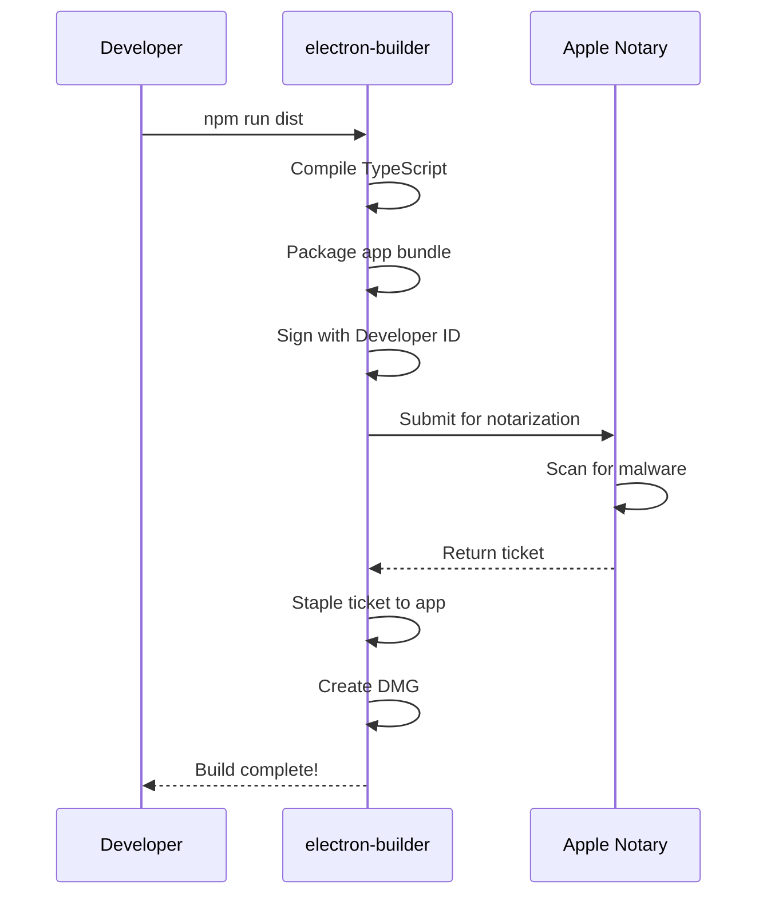
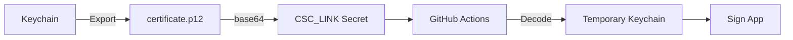

# Code Signing & Notarization Guide

Complete guide for signing and notarizing Task Floater for macOS distribution.

## Overview

```mermaid
flowchart LR
    subgraph Prerequisites
        A[Apple Developer Account] --> B[Developer ID Certificate]
        B --> C[App-Specific Password]
    end

    subgraph Build Process
        D[npm run dist] --> E[Code Signing]
        E --> F[Notarization]
        F --> G[Stapling]
        G --> H[DMG Creation]
    end

    subgraph Distribution
        H --> I[GitHub Release]
        I --> J[User Downloads]
        J --> K[No Gatekeeper Warnings]
    end

    Prerequisites --> Build Process
```

## Quick Start

Already have everything set up? Here's the quick version:

```bash
# Load credentials
source .env.signing

# Build signed + notarized
npm run dist

# Create release
gh release create v1.X.X release/*.dmg release/*.zip --generate-notes
```

---

## Prerequisites

| Requirement | Description | Where to Get |
|-------------|-------------|--------------|
| Apple Developer Account | $99/year membership | [developer.apple.com](https://developer.apple.com/programs/) |
| Developer ID Certificate | Code signing certificate | Apple Developer Portal |
| App-Specific Password | For notarization API | [appleid.apple.com](https://appleid.apple.com) |
| Xcode Command Line Tools | Build tools | `xcode-select --install` |

---

## Step 1: Get Developer ID Certificate

### Create Certificate Signing Request (CSR)

1. Open **Keychain Access**
2. Menu: **Keychain Access → Certificate Assistant → Request a Certificate From a Certificate Authority**
3. Enter your email and name
4. Select **"Saved to disk"**
5. Save the `.certSigningRequest` file

### Download Certificate from Apple

1. Go to [Apple Developer Portal → Certificates](https://developer.apple.com/account/resources/certificates/list)
2. Click **"+"** to create new certificate
3. Select **"Developer ID Application"**
4. Upload your CSR file
5. Download the `.cer` certificate
6. Double-click to install in Keychain

### Verify Installation

```bash
security find-identity -v -p codesigning
```

Expected output:
```
1) XXXXXXXXXX "Developer ID Application: Your Name (TEAM_ID)"
   1 valid identities found
```

Your **Team ID** is the 10-character code in parentheses (e.g., `SM3PR8224Z`).

---

## Step 2: Get App-Specific Password

Apple requires an app-specific password for notarization (not your regular Apple ID password).

1. Go to [appleid.apple.com](https://appleid.apple.com/account/manage)
2. Sign in with your Apple ID
3. Navigate to **Sign-In and Security → App-Specific Passwords**
4. Click **"+"** to generate a new password
5. Label it "Task Floater Notarization"
6. Copy the password (format: `xxxx-xxxx-xxxx-xxxx`)

---

## Step 3: Configure Local Environment

Create `.env.signing` in the project root:

```bash
export APPLE_ID="your-apple-id@email.com"
export APPLE_APP_SPECIFIC_PASSWORD="xxxx-xxxx-xxxx-xxxx"
export APPLE_TEAM_ID="YOUR_TEAM_ID"
```

Set proper permissions:
```bash
chmod 600 .env.signing
```

> **Security Note:** `.env.signing` is in `.gitignore` and will never be committed.

---

## Step 4: Build Signed & Notarized App

```bash
# Load environment variables
source .env.signing

# Build (signing + notarization happens automatically)
npm run dist
```

### What Happens During Build



**Build Output:**
```
release/
├── Task Floater-1.6.0.dmg           # Intel (x64)
├── Task Floater-1.6.0-arm64.dmg     # Apple Silicon
├── Task Floater-1.6.0-mac.zip       # Intel portable
├── Task Floater-1.6.0-arm64-mac.zip # Apple Silicon portable
└── latest-mac.yml                   # Auto-update manifest
```

---

## Step 5: Verify Signing

```bash
# Check code signature
codesign -dv --verbose=2 "release/mac/Task Floater.app"
```

Expected output includes:
```
Authority=Developer ID Application: Your Name (TEAM_ID)
Authority=Developer ID Certification Authority
Authority=Apple Root CA
```

```bash
# Check notarization
spctl -a -t open --context context:primary-signature -v "release/Task Floater-1.6.0.dmg"
```

Expected output:
```
release/Task Floater-1.6.0.dmg: accepted
source=Notarized Developer ID
```

---

## Manual Notarization

If automatic notarization fails or you need to notarize existing builds:

### Submit for Notarization

```bash
xcrun notarytool submit "release/Task Floater-1.6.0.dmg" \
  --apple-id "$APPLE_ID" \
  --password "$APPLE_APP_SPECIFIC_PASSWORD" \
  --team-id "$APPLE_TEAM_ID" \
  --wait
```

### Staple the Ticket

```bash
xcrun stapler staple "release/Task Floater-1.6.0.dmg"
```

### Check Status

```bash
# View all submissions
xcrun notarytool history \
  --apple-id "$APPLE_ID" \
  --password "$APPLE_APP_SPECIFIC_PASSWORD" \
  --team-id "$APPLE_TEAM_ID"

# Check specific submission
xcrun notarytool info <submission-id> \
  --apple-id "$APPLE_ID" \
  --password "$APPLE_APP_SPECIFIC_PASSWORD" \
  --team-id "$APPLE_TEAM_ID"

# Get log if failed
xcrun notarytool log <submission-id> \
  --apple-id "$APPLE_ID" \
  --password "$APPLE_APP_SPECIFIC_PASSWORD" \
  --team-id "$APPLE_TEAM_ID"
```

---

## GitHub Actions CI/CD

### Export Certificate for CI

Your certificate must be exported as a base64-encoded `.p12` file for GitHub Actions.



**Steps:**

1. **Export from Keychain:**
```bash
security export -k ~/Library/Keychains/login.keychain-db \
  -t identities -f pkcs12 \
  -P "YOUR_SECURE_PASSWORD" \
  -o ~/Desktop/certificate.p12
```

2. **Convert to base64:**
```bash
base64 -i ~/Desktop/certificate.p12 | pbcopy
# Base64 string is now in your clipboard
```

3. **Delete the .p12 file:**
```bash
rm ~/Desktop/certificate.p12
```

### Configure GitHub Secrets

Go to: `https://github.com/YOUR_USERNAME/task-floater/settings/secrets/actions`

Add these secrets:

| Secret Name | Value |
|-------------|-------|
| `APPLE_ID` | Your Apple ID email |
| `APPLE_APP_SPECIFIC_PASSWORD` | App-specific password |
| `APPLE_TEAM_ID` | Your 10-character Team ID |
| `CSC_LINK` | Base64-encoded certificate (from clipboard) |
| `CSC_KEY_PASSWORD` | Password used when exporting .p12 |
| `KEYCHAIN_PASSWORD` | Any secure password (for CI keychain) |

### Workflow Configuration

The release workflow (`.github/workflows/release.yml`) handles everything automatically:

```yaml
- name: Build and Sign
  env:
    CSC_LINK: ${{ secrets.CSC_LINK }}
    CSC_KEY_PASSWORD: ${{ secrets.CSC_KEY_PASSWORD }}
    APPLE_ID: ${{ secrets.APPLE_ID }}
    APPLE_APP_SPECIFIC_PASSWORD: ${{ secrets.APPLE_APP_SPECIFIC_PASSWORD }}
    APPLE_TEAM_ID: ${{ secrets.APPLE_TEAM_ID }}
  run: npm run dist
```

### Trigger a Release

```bash
# Create and push a tag
git tag v1.6.1
git push origin v1.6.1

# GitHub Actions will automatically:
# 1. Run tests
# 2. Build the app
# 3. Sign with your certificate
# 4. Notarize with Apple
# 5. Create GitHub Release with DMG files
```

---

## Troubleshooting

### "No valid signing identity found"

```bash
# List available identities
security find-identity -v -p codesigning

# If empty, reinstall certificate from Apple Developer Portal
```

### Certificate and private key in different keychains

The `.p12` export requires both certificate AND private key. If they're separated:

```bash
# Export cert from System keychain
security export -k /Library/Keychains/System.keychain \
  -t certs -f pemseq -o ~/Desktop/cert.pem

# Import to login keychain (where private key is)
security import ~/Desktop/cert.pem -k ~/Library/Keychains/login.keychain-db

# Now export as .p12
security export -k ~/Library/Keychains/login.keychain-db \
  -t identities -f pkcs12 -P "PASSWORD" -o ~/Desktop/certificate.p12
```

### "Notarization failed"

1. **Check credentials:**
   ```bash
   echo "APPLE_ID: $APPLE_ID"
   echo "TEAM_ID: $APPLE_TEAM_ID"
   ```

2. **Get the error log:**
   ```bash
   xcrun notarytool log <submission-id> \
     --apple-id "$APPLE_ID" \
     --password "$APPLE_APP_SPECIFIC_PASSWORD" \
     --team-id "$APPLE_TEAM_ID"
   ```

3. **Common issues:**
   - Using regular password instead of app-specific password
   - Team ID doesn't match certificate
   - Hardened runtime not enabled
   - Missing entitlements

### Notarization stuck "In Progress"

Apple's service can be slow during peak times. Options:
- Wait longer (can take 30+ minutes)
- Check [Apple System Status](https://developer.apple.com/system-status/)
- Cancel and retry later

### "App is damaged" error for users

The app wasn't properly signed or notarized. For users with this issue:

```bash
# Remove quarantine attribute
xattr -cr /Applications/Task\ Floater.app
```

Or: Right-click → Open → Click "Open" in dialog

### CI/CD not signing

1. Verify all GitHub secrets are configured
2. Check CSC_LINK is valid base64:
   ```bash
   echo "$CSC_LINK" | base64 -d > /tmp/test.p12
   # Should create a valid .p12 file
   ```
3. Ensure CSC_KEY_PASSWORD matches the export password

---

## Configuration Reference

### package.json Build Section

```json
{
  "build": {
    "appId": "com.reap.task-floater",
    "productName": "Task Floater",
    "mac": {
      "category": "public.app-category.productivity",
      "target": [
        { "target": "dmg", "arch": ["x64", "arm64"] },
        { "target": "zip", "arch": ["x64", "arm64"] }
      ],
      "identity": "Your Name (TEAM_ID)",
      "hardenedRuntime": true,
      "gatekeeperAssess": false,
      "entitlements": "build/entitlements.mac.plist",
      "entitlementsInherit": "build/entitlements.mac.plist",
      "notarize": false
    },
    "afterSign": "scripts/notarize.js"
  }
}
```

### Entitlements (build/entitlements.mac.plist)

```xml
<?xml version="1.0" encoding="UTF-8"?>
<!DOCTYPE plist PUBLIC "-//Apple//DTD PLIST 1.0//EN" "...">
<plist version="1.0">
<dict>
    <key>com.apple.security.cs.allow-jit</key>
    <true/>
    <key>com.apple.security.cs.allow-unsigned-executable-memory</key>
    <true/>
    <key>com.apple.security.cs.allow-dyld-environment-variables</key>
    <true/>
</dict>
</plist>
```

### Environment Variables

| Variable | Description | Example |
|----------|-------------|---------|
| `APPLE_ID` | Apple ID email | `you@example.com` |
| `APPLE_APP_SPECIFIC_PASSWORD` | App-specific password | `xxxx-xxxx-xxxx-xxxx` |
| `APPLE_TEAM_ID` | 10-character Team ID | `SM3PR8224Z` |
| `CSC_LINK` | Base64 certificate (CI only) | `MIIKkQIB...` |
| `CSC_KEY_PASSWORD` | Certificate password (CI only) | `your-password` |

---

## Security Checklist

- [ ] `.env.signing` is in `.gitignore`
- [ ] `*.p12` is in `.gitignore`
- [ ] App-specific password used (not main password)
- [ ] GitHub Secrets configured (not committed)
- [ ] Local `.p12` file deleted after exporting
- [ ] Hardened runtime enabled
- [ ] Entitlements properly configured

---

## Quick Reference

| Task | Command |
|------|---------|
| Check certificate | `security find-identity -v -p codesigning` |
| Build signed app | `source .env.signing && npm run dist` |
| Verify signature | `codesign -dv "release/mac/Task Floater.app"` |
| Verify notarization | `spctl -a -v "release/Task Floater-1.6.0.dmg"` |
| Manual notarize | `xcrun notarytool submit ... --wait` |
| Staple ticket | `xcrun stapler staple "file.dmg"` |
| Check status | `xcrun notarytool history ...` |

---

*Last updated: January 2026*
